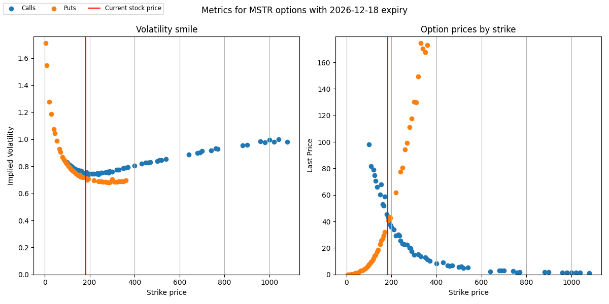

# Weekend Quant Projects

A collection of small quant finance projects, built with help from Claude and Copilot.

## [1. Pairs Trading](1_PairsTrading.ipynb)
Input two tickers and a test time frame. Tests cointegration directly, then runs a 
linear regression to derive a regression-adjusted spread. That spread is transformed 
into a rudimentary signal generator, indicating whether to go long or short the spread 
based on a chosen z-score tolerance. The model is run against in-sample data before 
being applied to OOS data, generating a PnL equity curve and Sharpe ratio. Transaction 
costs are configurable. A plot of Sharpe ratio vs. z-score threshold is generated for 
both in-sample and OOS data.

Different pairs were tested throughout, leading to insights on threshold selection, 
overfitting, and regime change — notably V/MA (potentially diverging under US domestic political 
pressure and market changes) and WBD/PSKY (acquisition-driven spread breakdown).

## [2. Black-Scholes Option Pricer with Monte Carlo Verification](2_BlackScholes_MonteCarlo.ipynb)
Implemented the trivial closed-form Black-Scholes call and put pricers, Greeks (delta, 
as proof of concept), and verified put-call parity. A Monte Carlo simulation 
confirms that the discounted expected payout converges to the BS price. Dividend yield 
is incorporated in the following project.

## [3. Implied Volatility Studies](3_ImpliedVolatility.ipynb)
Input a ticker and option expiry date, with filters for data quality (volume, open 
interest). Outputs the volatility smile alongside a price vs. strike curve. Explored 
left skew (SPY, NVDA) and right smirk (MSTR, driven by Bitcoin jump risk). Compared 
traded option prices against BS predictions using spot price, strike, expiry, implied 
vol, dividend yield, and a treasury-derived interest rate. 

Lastly, generated a cute 
implied volatility surface from expiry and strike using SPY, which required significant 
data cleaning and filtering.

## [4. Delta Hedging Simulator](4_DeltaHedging.ipynb)
Simulates the canonical delta hedging strategy for a European call option under GBM. At each timestep, the position is rebalanced to remain delta-neutral, with all cashflows discounted. The fun result is that hedging dramatically reduces PnL variance, leading to the same expected return with vastly lower standard deviation. The mean PnL is shown to cross zero exactly at implied vol, confirming that selling options is fundamentally a bet on realized vol being lower than implied vol.

## [5. Heston model simulations](5_HestonModel.ipynb)
Simulates stock behaviour with the Heston model, which can be used to extract an implied volatility. Tuning the input parameters (in particular, ξ and ρ) changes the smile shape, which matches the behaviour I observed in project [3](gen_Implied_vol.ipynb) - positive correlation leads to a right smirk (MSTR), while negative leads to left (SPY). Results are compared to my BS implementation [2](BS_MC.ipynb), which itself cannot incorporate stochastic variance, and thus doesn't generate the same smile behaviour. 

